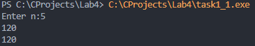
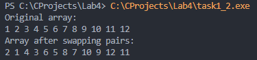
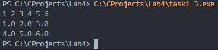
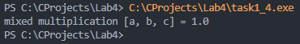
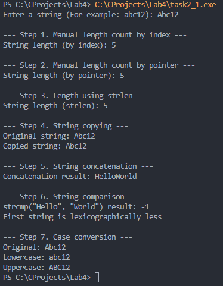
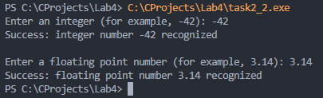
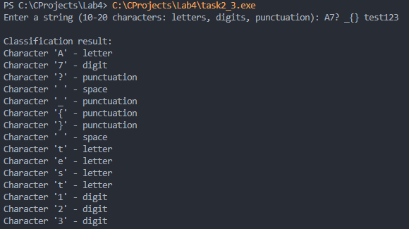

# Тема лабораторной работы: Введение в функции. Базовая работа со строками

## Комплект 1: Введение в функции
## Задача 1.1: Факториал: цикл и рекурсия (task1_1)

### Постановка задачи

Реализовать и сравнить два способа вычисления факториала: итеративный и рекурсивный. На вход подать целое число $n \ge 0$. Обе функции для одного и того же $n$ должны давать одинаковый ответ. Должен быть корректно обработан случай $n=0$ (факториал равен 1).

### Математическая модель

Факториал числа $n$ (обозначается $n!$) вычисляется следующим образом:

- Итеративно: $n! = 1 \cdot 2 \cdot 3 \cdot \dots \cdot n$ (при $n \ge 1$), $0! = 1$.
- Рекурсивно: $n! = n \cdot (n-1)!$ (при $n \ge 1$), $0! = 1$ (базовый случай).

### Список идентификаторов

| Имя переменной | Тип данных | Смысловое обозначение |
| :--- | :--- | :--- |
| `n` | `int` | Входное число для вычисления факториала |
| `i` | `int` | Счётчик цикла |
| `result` | `int` | Переменная для накопления результата в цикле |

### Код программы

```c
#include <stdio.h>

int factorial_iter(int n) {
    if (n <= 1)
    {
        return 1;
    }
    int result = 1;
    for (int i = 2; i <= n; i++)
    {
        result *= i;
    }
    return result;
}

int factorial_rec(int n) {
    if (n <= 1)
    {
        return 1;
    }
    return n * factorial_rec(n - 1);
}

int main(void) {
    int n;
    printf("Enter n:");
    if (scanf("%d", &n) == 1 && n >= 0)
    {
        printf("%d\n", factorial_iter(n));
        printf("%d\n", factorial_rec(n));
    }

    return 0;
}
```
### Результаты работы программы



---

## Задача 1.2: Обмен чётных/нечётных ячеек массива (task1_2)

### Постановка задачи

Отработать передачу динамического массива в функцию и изменение данных "по месту". На вход подать динамический массив int из 12 элементов. Функция должна делать попарный обмен соседних элементов: индексы 0<->1, 2<->3, 4<->5, ..., 10<->11. При этом размер массива не меняется, а перестановка выполняется только внутри каждой пары.

### Математическая модель

Обход элементов массива осуществляется в цикле с шагом 2. Для обмена значений соседних ячеек массива (с индексами `i` и `i+1`) используется вспомогательная переменная `temp`: `temp = arr[i]; arr[i] = arr[i+1]; arr[i+1] = temp;`.

### Список идентификаторов

| Имя переменной | Тип данных | Смысловое обозначение |
| :--- | :--- | :--- |
| `arr` | `int\*` | Указатель на динамический массив |
| `size`, `n` | `size_t` | Размер массива (количество элементов) |
| `i` | `size_t` | Счётчик цикла |
| `temp` | `int` | Временная переменная для обмена значений |

### Код программы

```c
#include <stdio.h>
#include <stdlib.h>

void swapPairs(int *arr, size_t size) {
    for (size_t i = 0; i + 1 < size; i += 2) {
        int temp = arr[i];
        arr[i] = arr[i + 1];
        arr[i + 1] = temp;
    }
}

void printArray(const int *arr, size_t size) {
    for (size_t i = 0; i < size; i++) {
        printf("%d ", arr[i]);
    }
    printf("\n");
}

int main(void) {
    size_t n = 12;

    int *arr = (int *)malloc(n * sizeof(int));
    if (arr == NULL) {
        printf("Memory allocation error\n");
        return 1;
    }

    for (size_t i = 0; i < n; i++) {
        arr[i] = (int)(i + 1);
    }

    printf("Original array:\n");
    printArray(arr, n);

    swapPairs(arr, n);

    printf("Array after swapping pairs:\n");
    printArray(arr, n);

    free(arr);

    return 0;
}
```
### Результаты работы программы



---

## Задача 1.3: Набор функций для матрицы double (task1_3)

### Постановка задачи
Выделять, заполнять, печатать и освобождать двумерный динамический массив без утечек памяти. На вход подаются размеры матрицы (rows, cols) и значения элементов. Если на этапе выделения памяти под одну из строк возникает ошибка, необходимо освободить уже выделенные строки и вернуть признак ошибки.

### Математическая модель
Двумерный массив (матрица) размером $rows \times cols$ представляется в памяти как массив указателей типа `double*`, где каждый элемент указывает на начало одномерного массива (строки). Доступ к элементу осуществляется с помощью двойной индексации: `matrix[i][j]`. При ошибке выделения памяти применяется обратный цикл очистки уже выделенных строк.

### Список идентификаторов
| Имя переменной | Тип данных | Смысловое обозначение |
| :--- | :--- | :--- |
| `matrix` | `double\*\*` | Указатель на массив указателей (матрица) |
| `rows`, `cols` | `size_t` | Количество строк и столбцов матрицы |
| `i`, `j` | `size_t` | Счётчики циклов для строк и столбцов |

### Код программы

```c
#include <stdio.h>
#include <stdlib.h>

// 1. Функция выделения памяти
double **allocate_matrix(size_t rows, size_t cols) {

    double **matrix = (double **)malloc(rows * sizeof(double *));
    if (matrix == NULL) {
        return NULL;
    }

    for (size_t i = 0; i < rows; i++) {
        matrix[i] = (double *)malloc(cols * sizeof(double));
        if (matrix[i] == NULL) {
            for (size_t j = 0; j < i; j++) {
                free(matrix[j]);
            }
            free(matrix);
            return NULL;
        }
    }
    return matrix;
}

// 2. Функция освобождения памяти
void free_matrix(double **matrix, size_t rows) {
    if (matrix != NULL) {
        for (size_t i = 0; i < rows; i++) {
            free(matrix[i]);
        }
        free(matrix);
    }
}

// 3. Функция заполнения матрицы
void fill_matrix(double **matrix, size_t rows, size_t cols) {
    for (size_t i = 0; i < rows; i++) {
        for (size_t j = 0; j < cols; j++) {
            scanf("%lf", &matrix[i][j]);
        }
    }
}

// 4. Функция печати матрицы
void print_matrix(double **matrix, size_t rows, size_t cols) {
    for (size_t i = 0; i < rows; i++) {
        for (size_t j = 0; j < cols; j++) {
            printf("%.1lf ", matrix[i][j]);
        }
        printf("\n");
    }
}

int main(void) {
    size_t rows = 2;
    size_t cols = 3;

    double **matrix = allocate_matrix(rows, cols);
    if (matrix == NULL) {
        printf("Memory allocation error\n");
        return 1;
    }

    fill_matrix(matrix, rows, cols);

    print_matrix(matrix, rows, cols);

    free_matrix(matrix, rows);

    return 0;
}
```
### Результаты работы программы



---

## Задача 1.4: Смешанное произведение трёх векторов в 3D (task1_4)

### Постановка задачи

Вычислять смешанное произведение через разбиение задачи на небольшие понятные функции. Реализовать функции векторного произведения (`cross3`), скалярного произведения (`dot3`) и смешанного произведения (`triple3`), использующую две предыдущие функции.

### Математическая модель

Смешанное произведение трёх векторов $a, b, c$ вычисляется как скалярное произведение вектора $a$ на векторное произведение векторов $b$ и $c$: $[a, b, c] = a \cdot (b \times c)$.
Векторное произведение: $b \times c = (b_y c_z - b_z c_y, b_z c_x - b_x c_z, b_x c_y - b_y c_x)$.
Скалярное произведение: $a \cdot tmp = a_x tmp_x + a_y tmp_y + a_z tmp_z$.

### Список идентификаторов

| Имя переменной | Тип данных | Смысловое обозначение |
| :--- | :--- | :--- |
| `a, b, c` | `double[3]` | Исходные трёхмерные векторы |
| `out` | `double[3]` | Результирующий вектор в функции cross3 |
| `tmp` | `double[3]` | Промежуточный вектор (результат b x c) |
| `result` | `double` | Значение смешанного произведения |

### Код программы

```c
#include <stdio.h>

void cross3(const double a[3], const double b[3], double out[3]) {
    out[0] = a[1] * b[2] - a[2] * b[1];
    out[1] = a[2] * b[0] - a[0] * b[2];
    out[2] = a[0] * b[1] - a[1] * b[0];
}

double dot3(const double a[3], const double b[3]) {
    return a[0] * b[0] + a[1] * b[1] + a[2] * b[2];
}

double triple3(const double a[3], const double b[3], const double c[3]) {
    double tmp[3];
    cross3(b, c, tmp);
    return dot3(a, tmp);
}

int main(void) {
    double a[3] = {1.0, 0.0, 0.0};
    double b[3] = {0.0, 1.0, 0.0};
    double c[3] = {0.0, 0.0, 1.0};

    double result = triple3(a, b, c);

    printf("mixed multiplication [a, b, c] = %.1lf\n", result);

    return 0;
}
```
### Результаты работы программы



---

## Комплект 2. Базовые операции со строками
## Задача 2.1: Базовые строковые операции (task2_1)

### Постановка задачи

Освоить базовые операции с С-строкой в пошаговом режиме (подсчет длины разными способами, копирование, конкатенация, сравнение, изменение регистра). На вход подается строка длиной около 10 латинских символов. Необходимо выполнить 7 шагов базовых строковых операций.

### Математическая модель

Для работы со строками используются библиотечные функции из `<string.h>` и `<ctype.h>`, а также ручной обход массива символов в цикле (по индексам и с использованием указателей) до достижения нулевого символа `\0`. Конкатенация, копирование и сравнение выполняются как встроенными средствами, так и с пониманием работы памяти. При смене регистра происходит безопасное приведение символа к типу `unsigned char`.

### Список идентификаторов

| Имя переменной | Тип данных | Смысловое обозначение |
| :--- | :--- | :--- |
| `my_string` | `char[]` | Исходная строка (буфер ввода) |
| `len`, `len1`, `len2`, `len3` | `size_t` | Переменные для хранения длины строки |
| `p` | `char\*` | Указатель для обхода строки |
| `copy` | `char[]` | Буфер для копии строки |
| `concat_buf` | `char[]` | Буфер для конкатенации |
| `cmp_res` | `int` | Результат сравнения строк |
| `lower_str`, `upper_str` | `char[]` | Строки в нижнем и верхнем регистрах |
| `c` | `unsigned char` | Текущий символ для смены регистра |

### Код программы

```c
#include <stdio.h>
#include <string.h>
#include <ctype.h>

#define MY_SIZE 32

int main(void)
{
    char my_string[MY_SIZE];

    printf("Enter a string (For example: abc12): ");
    if (fgets(my_string, sizeof(my_string), stdin))
    {

        size_t len = strlen(my_string);
        if (len > 0 && my_string[len - 1] == '\n')
        {
            my_string[len - 1] = '\0';
        }

        printf("\n--- Step 1. Manual length count by index ---\n");
        size_t len1 = 0;
        for (size_t i = 0; my_string[i] != '\0'; i++)
        {
            len1++;
        }
        printf("String length (by index): %zu\n", len1);

        printf("\n--- Step 2. Manual length count by pointer ---\n");
        size_t len2 = 0;
        char *p = my_string;
        while (*p != '\0')
        {
            len2++;
            p++;
        }
        printf("String length (by pointer): %zu\n", len2);

        printf("\n--- Step 3. Length using strlen ---\n");
        size_t len3 = strlen(my_string);
        printf("String length (strlen): %zu\n", len3);

        printf("\n--- Step 4. String copying ---\n");
        char copy[MY_SIZE];
        strcpy(copy, my_string);
        printf("Original string: %s\n", my_string);
        printf("Copied string: %s\n", copy);

        printf("\n--- Step 5. String concatenation ---\n");
        char concat_buf[MY_SIZE * 2] = "Hello";
        strcat(concat_buf, "World");
        printf("Concatenation result: %s\n", concat_buf);

        printf("\n--- Step 6. String comparison ---\n");
        int cmp_res = strcmp("Hello", "World");
        printf("strcmp(\"Hello\", \"World\") result: %d\n", cmp_res);
        if (cmp_res < 0)
        {
            printf("First string is lexicographically less\n");
        }
        else if (cmp_res == 0)
        {
            printf("Strings are equal\n");
        }
        else
        {
            printf("First string is greater\n");
        }

        printf("\n--- Step 7. Case conversion ---\n");
        char lower_str[MY_SIZE];
        char upper_str[MY_SIZE];

        for (size_t i = 0; my_string[i] != '\0'; i++)
        {
            unsigned char c = (unsigned char)my_string[i];
            lower_str[i] = (char)tolower(c);
            upper_str[i] = (char)toupper(c);
        }

        lower_str[len3] = '\0';
        upper_str[len3] = '\0';

        printf("Original: %s\n", my_string);
        printf("Lowercase: %s\n", lower_str);
        printf("Uppercase: %s\n", upper_str);
    }

    return 0;
}
```
### Результаты работы программы



---

## Задача 2.2: Конвертация строк в числа (task2_2)

### Постановка задачи

Безопасно преобразовывать текст в `int` (в коде используется `long`) и `double`, чтобы программа корректно реагировала на ошибочный ввод. Для целого числа использовать `strtol`, для вещественного — `strtod`. Перед преобразованием обнулять `errno`. После преобразования проверять: распознан ли хотя бы один числовой символ, не произошло ли переполнение диапазона (`ERANGE`), и не остались ли лишние символы после числа.

### Математическая модель

Преобразование строкового представления числа в машинный числовой формат (`long` и `double`). Для безопасного преобразования используются библиотечные функции `strtol` и `strtod`, которые принимают строку и возвращают само число, а также устанавливают указатель `endptr` на первый нераспознанный символ (что позволяет выявлять лишний текст после числа). Ошибки переполнения отслеживаются через системную переменную `errno`.

### Список идентификаторов

| Имя переменной | Тип данных | Смысловое обозначение |
| :--- | :--- | :--- |
| `int_str` | `char[]` | Буфер для ввода строки с целым числом |
| `double_str` | `char[]` | Буфер для ввода строки с вещественным числом |
| `endptr` | `char\*` | Указатель на первый нераспознанный символ |
| `int_val` | `long` | Результат преобразования в целое число |
| `double_val` | `double` | Результат преобразования в вещественное число |

### Код программы

```c
#include <stdio.h>
#include <stdlib.h>
#include <errno.h>

int main(void)
{
    char int_str[64];
    char double_str[64];

    // Integer number processing
    printf("Enter an integer (for example, -42): ");
    if (fgets(int_str, sizeof(int_str), stdin))
    {
        char *endptr;
        errno = 0;

        long int_val = strtol(int_str, &endptr, 10);

        if (endptr == int_str)
        {
            printf("Error: no digits recognized for integer number.\n");
        }
        else if (errno == ERANGE)
        {
            printf("Error: range overflow occurred (ERANGE).\n");
        }
        else
        {
            if (*endptr != '\0' && *endptr != '\n')
            {
                printf("Warning: extra characters detected after integer number ('%s').\n", endptr);
            }
            printf("Success: integer number %ld recognized\n", int_val);
        }
    }

    // Floating point number processing
    printf("\nEnter a floating point number (for example, 3.14): ");
    if (fgets(double_str, sizeof(double_str), stdin))
    {
        char *endptr;
        errno = 0;

        double double_val = strtod(double_str, &endptr);

        if (endptr == double_str)
        {
            printf("Error: no digits recognized for floating point number.\n");
        }
        else if (errno == ERANGE)
        {
            printf("Error: range overflow occurred (ERANGE).\n");
        }
        else
        {
            if (*endptr != '\0' && *endptr != '\n')
            {
                printf("Warning: extra characters detected after floating point number ('%s').\n", endptr);
            }
            printf("Success: floating point number %.2f recognized\n", double_val);
        }
    }

    return 0;
}
```
### Результаты работы программы



---

## Задача 2.3: Классификация символов (task2_3)

### Постановка задачи

Научиться классифицировать каждый символ строки с помощью функций из `ctype.h`. На вход подается строка длиной 10-20 символов (цифры, латиница, пробелы, знаки пунктуации). Необходимо организовать цикл по всем символам до NUL и для каждого проверить его свойства (`isdigit`, `isalpha`, `isspace`, `ispunct`), сформировав строку отчёта в понятном виде. При вызове функций проверки символ необходимо приводить к `unsigned char` во избежание неопределённого поведения.

### Математическая модель

Строка обходится посимвольно в цикле `for` от нулевого индекса до достижения нуль-терминатора `\0`. Для классификации каждого символа используются библиотечные функции предиката (`isalpha`, `isdigit`, `isspace`, `ispunct`), которые возвращают ненулевое значение (истину), если символ принадлежит к указанной группе. Для безопасной обработки текущий символ предварительно явно приводится к типу `unsigned char`.

### Список идентификаторов

| Имя переменной | Тип данных | Смысловое обозначение |
| :--- | :--- | :--- |
| `str` | `char[]` | Буфер для ввода исходной строки |
| `len` | `size_t` | Длина строки (используется для удаления переноса каретки) |
| `i` | `size_t` | Счётчик цикла для посимвольного обхода |
| `c` | `unsigned char` | Текущий символ для безопасной передачи в функции классификации |

### Код программ

```c
#include <stdio.h>
#include <ctype.h>
#include <string.h>

int main(void)
{
    char str[64];

    printf("Enter a string (10-20 characters: letters, digits, punctuation): ");
    if (fgets(str, sizeof(str), stdin))
    {
        size_t len = strlen(str);
        if (len > 0 && str[len - 1] == '\n')
        {
            str[len - 1] = '\0';
        }

        printf("\nClassification result:\n");
        for (size_t i = 0; str[i] != '\0'; i++)
        {
            unsigned char c = (unsigned char)str[i];

            printf("Character '%c' - ", c);

            if (isalpha(c))
            {
                printf("letter\n");
            }
            else if (isdigit(c))
            {
                printf("digit\n");
            }
            else if (isspace(c))
            {
                printf("space\n");
            }
            else if (ispunct(c))
            {
                printf("punctuation\n");
            }
            else
            {
                printf("other character\n");
            }
        }
    }

    return 0;
}
```
### Результаты работы программы



---

## Информация о студенте

Козодой Владимир , 1 курс, группа 1об_ИВТ-1/25.
