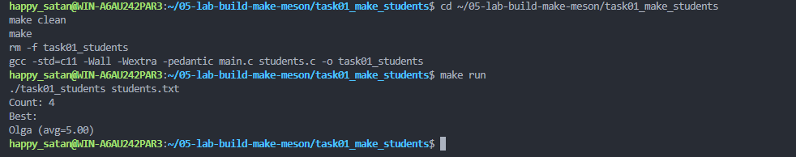
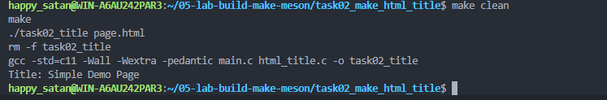
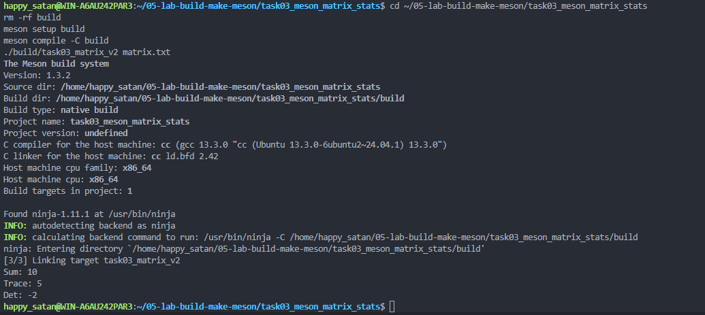
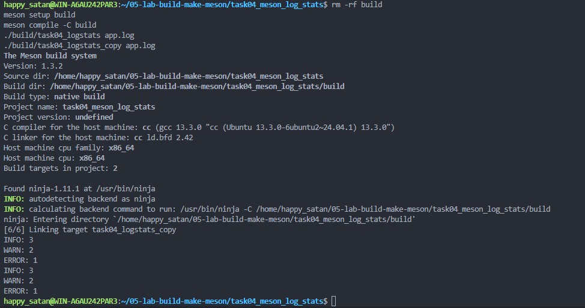

# Тема лабораторной работы: Сборка C-проектов с GNU Make и Meson

## Комплект 1: Сборка с GNU Make
## Задача 1.1: Лучший студент по среднему баллу (task01_make_students)

### Постановка задачи

Реализовать программу, которая читает текстовый файл со списком студентов и их оценок, вычисляет средний балл каждого студента и выводит имя студента с максимальным средним баллом. Программа должна быть собрана из двух исходных модулей с помощью Makefile. Добавить цель `run` для запуска программы на учебном входном файле.

### Математическая модель

Для каждого студента заданы три оценки (score1, score2, score3). Средний балл вычисляется как среднее арифметическое трёх оценок:

$avg = (score1 + score2 + score3) / 3$

Программа находит студента с максимальным значением `avg` и выводит его имя и средний балл.

### Список идентификаторов

| Имя переменной | Тип данных | Смысловое обозначение |
| :--- | :--- | :--- |
| `Student` | `struct` | Структура, содержащая имя студента и его оценки |
| `students` | `Student[]` | Массив студентов |
| `count` | `int` | Количество загруженных студентов |
| `best` | `int` | Индекс студента с максимальным средним баллом |

### Код программы

main.c:

```c
#include "students.h"
#include <stdio.h>

int main(int argc, char *argv[]) {
    Student students[100];
    const char *path = "students.txt";
    int count;
    int best;

    if (argc > 1) {
        path = argv[1];
    }

    count = load_students(path, students, 100);
    if (count <= 0) {
        printf("Cannot read students file: %s\n", path);
        return 1;
    }

    best = find_best_student(students, count);
    printf("Count: %d\n", count);
    printf("Best: %s (avg=%.2f)\n", students[best].name, students[best].avg);

    return 0;
}

students.h:

#ifndef STUDENTS_H
#define STUDENTS_H

typedef struct {
    char name[64];
    int score1;
    int score2;
    int score3;
    double avg;
} Student;

int load_students(const char *filename, Student arr[], int max_count);
int find_best_student(const Student arr[], int count);

#endif

students.c:

#include "students.h"
#include <stdio.h>

int load_students(const char *filename, Student arr[], int max_count) {
    FILE *f = fopen(filename, "r");
    int count = 0;

    if (!f) {
        return -1;
    }

    while (count < max_count) {
        Student s;
        int n = fscanf(f, "%63[^,],%d,%d,%d", s.name, &s.score1, &s.score2, &s.score3);
        if (n != 4) {
            break;
        }
        s.avg = (s.score1 + s.score2 + s.score3) / 3.0;
        arr[count] = s;
        count++;
    }

    fclose(f);
    return count;
}

int find_best_student(const Student arr[], int count) {
    int best = 0;
    int i;
    for (i = 1; i < count; i++) {
        if (arr[i].avg > arr[best].avg) {
            best = i;
        }
    }
    return best;
}

Makefile:

CC = gcc
CFLAGS = -std=c11 -Wall -Wextra -pedantic
TARGET = task01_students
SRC = main.c students.c

all: $(TARGET)

$(TARGET): $(SRC)
    $(CC) $(CFLAGS) $(SRC) -o $(TARGET)

run: $(TARGET)
    ./$(TARGET) students.txt

clean:
    rm -f $(TARGET)

students.txt:

Ivan,5,4,5
Olga,5,5,5
Petr,3,4,4
Nina,4,4,5
```

### Результаты работы программы


---

## Задача 1.2: Извлечение <title> из HTML (task02_make_html_title)

### Постановка задачи

Реализовать программу, которая читает локальный HTML-файл и извлекает текст между тегами <title> и </title>. Добавить отдельную цель debug, которая собирает программу с флагом -g для отладочной информации.

### Математическая модель

Программа считывает содержимое HTML-файла в строковый буфер, затем с помощью функции strstr находит позицию открывающего тега <title>, смещается на длину этого тега и находит позицию закрывающего тега </title>. Текст между ними копируется в выходной буфер.

### Список идентификаторов

| Имя переменной | Тип данных | Смысловое обозначение |
| :--- | :--- | :--- |
| `html` | `char[]` | Буфер для хранения содержимого HTML-файла |
| `title` | `char[]` | Буфер для извлечённого заголовка |
| `open_tag` | `const char*` | Строка "<title>" |
| `close_tag` | `const char*` | Строка "</title>" |
| `start` | `const char*` | Указатель на начало тега <title> |
| `end` | `const char*` | Указатель на конец тега </title> |

### Код программы

```c
main.c:

#include "html_title.h"
#include <stdio.h>

int main(int argc, char *argv[]) {
    char html[8192];
    char title[256];
    const char *path = "page.html";

    if (argc > 1) {
        path = argv[1];
    }

    if (load_text_file(path, html, sizeof(html)) != 0) {
        printf("Cannot read html file: %s\n", path);
        return 1;
    }

    if (extract_title(html, title, sizeof(title)) != 0) {
        printf("Tag <title> not found\n");
        return 1;
    }

    printf("Title: %s\n", title);
    return 0;
}

html_title.h:

#ifndef HTML_TITLE_H
#define HTML_TITLE_H

#include <stdio.h>

int load_text_file(const char *filename, char *buffer, size_t buffer_size);
int extract_title(const char *html, char *title, size_t title_size);

#endif

html_title.c:

#include "html_title.h"
#include <string.h>

int load_text_file(const char *filename, char *buffer, size_t buffer_size) {
    FILE *f;
    size_t n;

    f = fopen(filename, "r");
    if (!f) {
        return -1;
    }

    n = fread(buffer, 1, buffer_size - 1, f);
    buffer[n] = '\0';
    fclose(f);
    return 0;
}

int extract_title(const char *html, char *title, size_t title_size) {
    const char *open_tag = "<title>";
    const char *close_tag = "</title>";
    const char *start;
    const char *end;
    size_t len;

    start = strstr(html, open_tag);
    if (!start) {
        return -1;
    }

    start += strlen(open_tag);
    end = strstr(start, close_tag);
    if (!end) {
        return -1;
    }

    len = (size_t)(end - start);
    if (len >= title_size) {
        len = title_size - 1;
    }

    memcpy(title, start, len);
    title[len] = '\0';
    return 0;
}

Makefile:

CC = gcc
CFLAGS = -std=c11 -Wall -Wextra -pedantic
TARGET = task02_title
SRC = main.c html_title.c

all: $(TARGET)

$(TARGET): $(SRC)
    $(CC) $(CFLAGS) $(SRC) -o $(TARGET)

debug:
    $(CC) $(CFLAGS) -g $(SRC) -o $(TARGET)

clean:
    rm -f $(TARGET)

page.html:

<!doctype html>
<html>
<head>
    <title>Simple Demo Page</title>
</head>
<body>
    <h1>Hello</h1>
    <p>Training file for task02.</p>
</body>
</html>
```

### Результаты работы программы



---

## Комплект 2: Сборка с Meson
## Задача 2.1: Статистика матрицы 2x2 (task03_meson_matrix_stats)

### Постановка задачи

Реализовать программу, которая читает матрицу 2x2 из текстового файла и вычисляет сумму элементов, след и определитель. Выполнить базовый цикл работы с Meson: описать проект в meson.build, создать каталог сборки, собрать программу и запустить полученный исполняемый файл.

### Математическая модель

Для матрицы M = [[a, b], [c, d]]:

- Сумма элементов: sum = a + b + c + d
- След матрицы: trace = a + d
- Определитель: det = a * d - b * c

### Список идентификаторов

### Список идентификаторов

| Имя переменной | Тип данных | Смысловое обозначение |
| :--- | :--- | :--- |
| `m` | `int[2][2]` | Матрица 2x2 |
| `a, b, c, d` | `int` | Элементы матрицы |

### Код программы

```c
main.c:

#include "matrix_stats.h"
#include <stdio.h>

int main(int argc, char *argv[]) {
    int m[2][2];
    const char *path = "matrix.txt";

    if (argc > 1) {
        path = argv[1];
    }

    if (read_matrix_2x2(path, m) != 0) {
        printf("Cannot read matrix file: %s\n", path);
        return 1;
    }

    printf("Sum: %d\n", matrix_sum_2x2(m));
    printf("Trace: %d\n", matrix_trace_2x2(m));
    printf("Det: %d\n", matrix_det_2x2(m));

    return 0;
}

matrix_stats.h:

#ifndef MATRIX_STATS_H
#define MATRIX_STATS_H

int read_matrix_2x2(const char *filename, int m[2][2]);
int matrix_sum_2x2(const int m[2][2]);
int matrix_trace_2x2(const int m[2][2]);
int matrix_det_2x2(const int m[2][2]);

#endif

matrix_stats.c:

#include "matrix_stats.h"
#include <stdio.h>

int read_matrix_2x2(const char *filename, int m[2][2]) {
    FILE *f;

    f = fopen(filename, "r");
    if (!f) {
        return -1;
    }

    if (fscanf(f, "%d %d %d %d", &m[0][0], &m[0][1], &m[1][0], &m[1][1]) != 4) {
        fclose(f);
        return -1;
    }

    fclose(f);
    return 0;
}

int matrix_sum_2x2(const int m[2][2]) {
    return m[0][0] + m[0][1] + m[1][0] + m[1][1];
}

int matrix_trace_2x2(const int m[2][2]) {
    return m[0][0] + m[1][1];
}

int matrix_det_2x2(const int m[2][2]) {
    return m[0][0] * m[1][1] - m[0][1] * m[1][0];
}

meson.build:

project('task03_meson_matrix_stats', 'c',
  default_options : ['c_std=c11', 'warning_level=2'])

executable('task03_matrix_v2', ['main.c', 'matrix_stats.c'])

matrix.txt:

1 2 3 4
```

### Результаты работы программы


---

## Задача 2.2: Подсчёт INFO/WARN/ERROR (task04_meson_log_stats)

### Постановка задачи

Реализовать программу, которая читает текстовый лог-файл и считает количество строк с метками INFO, WARN и ERROR. Объявить в одном meson.build две исполняемые цели, которые используют один и тот же набор исходных файлов.

### Математическая модель

Программа построчно читает лог-файл. Для каждой строки проверяется наличие подстрок "INFO", "WARN" или "ERROR". При нахождении соответствующего ключевого слова увеличивается счётчик. Результат выводится в формате:

INFO: N
WARN: N
ERROR: N

### Список идентификаторов

### Список идентификаторов

| Имя переменной | Тип данных | Смысловое обозначение |
| :--- | :--- | :--- |
| `stats` | `LogStats` | Структура для хранения счётчиков |
| `info_count` | `int` | Количество строк с INFO |
| `warn_count` | `int` | Количество строк с WARN |
| `error_count` | `int` | Количество строк с ERROR |
| `line` | `char[]` | Буфер для чтения строки из файла |

### Код программы

```c
main.c:

#include "log_stats.h"
#include <stdio.h>

int main(int argc, char *argv[]) {
    LogStats stats;
    const char *path = "app.log";

    if (argc > 1) {
        path = argv[1];
    }

    if (analyze_log_file(path, &stats) != 0) {
        printf("Cannot read log file: %s\n", path);
        return 1;
    }

    printf("INFO: %d\n", stats.info_count);
    printf("WARN: %d\n", stats.warn_count);
    printf("ERROR: %d\n", stats.error_count);

    return 0;
}

log_stats.h:

#ifndef LOG_STATS_H
#define LOG_STATS_H

typedef struct {
    int info_count;
    int warn_count;
    int error_count;
} LogStats;

int analyze_log_file(const char *filename, LogStats *stats);

#endif

log_stats.c:

#include "log_stats.h"
#include <stdio.h>
#include <string.h>

int analyze_log_file(const char *filename, LogStats *stats) {
    FILE *f;
    char line[512];

    f = fopen(filename, "r");
    if (!f) {
        return -1;
    }

    stats->info_count = 0;
    stats->warn_count = 0;
    stats->error_count = 0;

    while (fgets(line, sizeof(line), f)) {
        if (strstr(line, "INFO") != NULL) {
            stats->info_count++;
        } else if (strstr(line, "WARN") != NULL) {
            stats->warn_count++;
        } else if (strstr(line, "ERROR") != NULL) {
            stats->error_count++;
        }
    }

    fclose(f);
    return 0;
}

meson.build:

project('task04_meson_log_stats', 'c',
  default_options : ['c_std=c11', 'warning_level=2'])

executable('task04_logstats', ['main.c', 'log_stats.c'])
executable('task04_logstats_copy', ['main.c', 'log_stats.c'])

app.log:

2026-05-01 10:00:01 INFO Application started
2026-05-01 10:00:05 WARN Slow response from service A
2026-05-01 10:00:08 INFO Retry succeeded
2026-05-01 10:00:10 ERROR Cannot open config backup
2026-05-01 10:00:15 INFO User logged in
2026-05-01 10:00:20 WARN High memory usage
```

### Результаты работы программы


---

## Информация о студенте

Козодой Владимир, 1 курс, группа 1об_ИВТ-1/25.